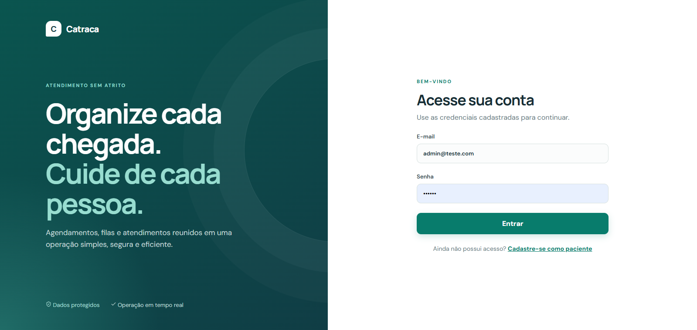

# Catraca

O Catraca é um sistema que desenvolvi para organizar agendamentos, filas e chamadas de atendimento. A ideia foi reproduzir situações de uma operação real: horários com capacidade limitada, encaixes, diferentes níveis de acesso, chamadas públicas e alterações simultâneas na fila.

Neste projeto eu pratiquei a integração entre Angular e Spring Boot, autenticação com renovação de sessão, modelagem de regras de negócio, migrations, controle de concorrência e atualização em tempo real com Server-Sent Events (SSE).

## O que implementei

- agendamentos com horários, capacidade e encaixes;
- filas configuráveis, prioridades e chamadas por guichê;
- painel público atualizado em tempo real, sem expor a sessão do operador;
- chamada sonora e por voz no painel público, usando os recursos do navegador;
- perfis de acesso para administração, recepção, profissionais e pacientes;
- cadastros de unidades, serviços, salas, guichês, profissionais e escalas;
- notificações no sistema e envio opcional por e-mail;
- auditoria técnica restrita ao perfil de desenvolvimento;
- renovação silenciosa da sessão quando o token de acesso expira.


## Demonstração visual
As telas abaixo só correspondem a uma pequena parte do projeto.

<p align="center">
  
  
</p>

<p align="center">
  
</p>

## Revisão de código

O sistema já cobre o fluxo principal, mas ainda não considero o projeto encerrado. Minha revisão atual está concentrada nestes pontos:

- revisar o código e reduzir trechos repetidos, aproveitando melhor os componentes, textos, erros e estilos compartilhados;
- adicionar um botão de voltar nas telas em que a navegação pelo menu não é suficiente;
- revisar o envio, recorte e exibição da imagem usada no perfil e no crachá;
- melhorar o visual e a organização das informações do crachá, inclusive na impressão;
- testar e ajustar a responsividade em celulares, tablets e telas intermediárias;
- rever a regra de prioridade das filas e documentar melhor como peso, horário agendado e tempo de espera influenciam a chamada;
- concluir e revisar a edição das escalas, principalmente a regeneração de horários e o impacto em agendamentos existentes;
- revisar contraste, espaçamento, estados vazios, mensagens de erro e consistência dos componentes;
- ampliar os testes dos fluxos de agendamento, fila, edição de escalas e renovação de sessão.


## Tecnologias

- Angular 20 com componentes standalone, lazy loading, guards, interceptor e formulários reativos;
- Spring Boot 3.5 e Java 21;
- Spring Security, API REST e SSE;
- PostgreSQL 17 e Flyway;
- Docker Compose para frontend e backend.

## Executar localmente

Pré-requisitos: Java 21, Node.js, npm e PostgreSQL 17. Docker é opcional para executar frontend e backend em contêineres.

Crie o banco, copie e preencha as variáveis de ambiente e suba os serviços:

```bash
cp .env.example .env
docker compose up --build -d
```

- aplicação: <http://localhost:4200>;
- API: <http://localhost:8080>;
- health check: <http://localhost:8080/actuator/health>.


## Usuários de demonstração

Com o perfil Spring `local`, as migrations de teste criam usuários fictícios. A relação está em [backend/TEST-USERS.md](backend/TEST-USERS.md).

As contas usam a senha simples `123456` somente para demonstração local. Ela não deve ser reutilizada em contas reais.

## E-mail

O envio é opcional. Para ativá-lo, configure `SMTP_ENABLED=true`, `SMTP_USERNAME` e `SMTP_PASSWORD`.

## Ordem de chamada das filas

A chamada usa uma regra determinística com envelhecimento para reduzir o risco de espera indefinida:

1. calcula a pontuação efetiva como `peso da prioridade + 1 ponto por bloco completo de 15 minutos de espera`;
2. chama primeiro a maior pontuação;
3. em empate, prioriza o horário agendado mais antigo; fichas sem agendamento vêm depois;
4. persistindo o empate, chama quem entrou primeiro na fila.

Exemplo: uma prioridade de peso `5` começa cinco pontos à frente de uma ficha comum, mas uma ficha comum aguardando 90 minutos alcança seis pontos e passa à frente de uma prioridade recém-chegada. A seleção usa bloqueio transacional com `SKIP LOCKED`, evitando que dois guichês chamem a mesma ficha simultaneamente.
